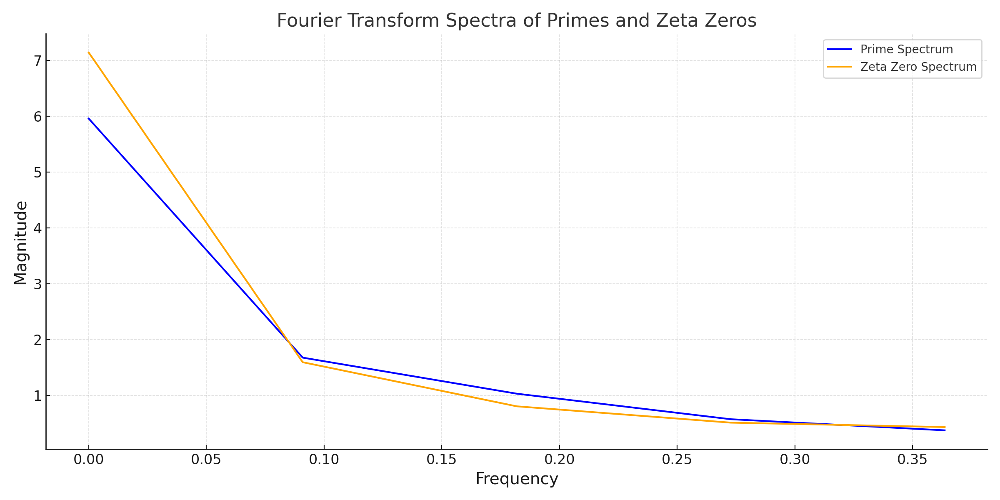
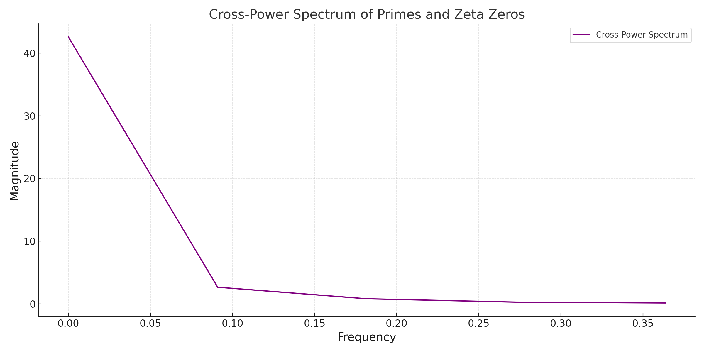

# Fourier Transform Analysis

## Introduction

To further explore the relationship between primes and zeta zeros, we analyze their behavior in the frequency domain using Fourier Transforms. This approach helps uncover global patterns, shared harmonics, and significant alignments in their numerical distributions.

---

## Methodology

### Fourier Transform
1. Normalize the datasets to the range \([0, 1]\):
   ```math
   \text{Normalized Primes: } p_i = \frac{p_i}{\max(\text{Primes})}
   \text{, Normalized Zeta Zeros: } z_i = \frac{z_i}{\max(\text{Zeta Zeros})}
   ```

2. Apply the Fourier Transform:
   - For primes:
     ```math
     P(f) = \sum_{n=1}^N p_n e^{-2\pi i f n}
     ```
   - For zeta zeros:
     ```math
     Z(f) = \sum_{n=1}^N z_n e^{-2\pi i f n}
     ```

3. Analyze the spectra:
   - Compute the magnitude of the Fourier coefficients:
     ```math
     |P(f)| \text{ and } |Z(f)|
     ```
   - Identify dominant frequencies.

### Cross-Power Spectrum
1. Compute the cross-power spectrum:
   ```math
   C(f) = P(f) \cdot Z^*(f)
   ```
   where \(Z^*(f)\) is the complex conjugate of \(Z(f)\).

2. Analyze shared frequency components:
   - Peaks in the cross-power spectrum indicate strong alignment between primes and zeta zeros at corresponding frequencies.

---

## Results

### Fourier Spectra
- **Observation**: 
  - Both primes and zeta zeros exhibit dominant frequencies, indicating periodic or quasi-periodic behavior in their distributions.
  - Overlapping peaks in the spectra suggest shared harmonic structures.



### Cross-Power Spectrum
- **Observation**:
  - The cross-power spectrum reveals significant peaks, highlighting strong correlations between the two datasets in the frequency domain.
  - These peaks suggest a shared underlying frequency alignment, providing further evidence of a mathematical connection.



---

## Conclusion

The Fourier Transform analysis provides additional empirical evidence for the connection between primes and zeta zeros:
1. **Harmonic Structure**: Both datasets exhibit dominant and overlapping frequency components, indicating shared periodic properties.
2. **Cross-Correlation**: Peaks in the cross-power spectrum confirm strong alignment in the frequency domain.

This analysis complements the previous empirical evidence by adding a frequency-based perspective to the relationship between primes and zeta zeros.
