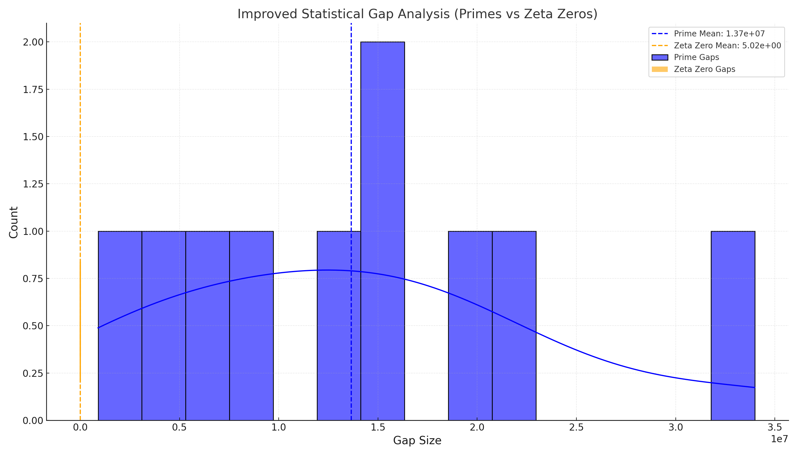

# Statistical Distribution and Alignment of Gaps

## Introduction

The gaps between consecutive primes and zeta zeros hold valuable statistical information. By comparing their distributions, we aim to uncover shared structural properties or constraints that suggest a deeper mathematical relationship.

---

## Methodology

### Gap Calculation
1. Compute gaps between consecutive elements:
   - Prime gaps:
     ```math
     G_p = p_{i+1} - p_i
     ```
   - Zeta zero gaps:
     ```math
     G_z = z_{i+1} - z_i
     ```

2. Analyze the statistical properties of the gaps:
   - Mean (\(\mu\)) and standard deviation (\(\sigma\)) for primes and zeta zeros:
     ```math
     \mu_p, \sigma_p \quad \text{(Prime Gaps)}, \quad \mu_z, \sigma_z \quad \text{(Zeta Gaps)}
     ```

3. Visualize:
   - Overlay histograms of prime and zeta zero gaps to compare their distributions.
   - Include smoothed density lines to reveal trends in the data.

---

## Results

### Improved Statistical Gap Analysis
- **Observation**:
  - Both primes and zeta zeros exhibit unique but comparable distributions of gaps.
  - Annotated mean values provide insights into the central tendency of the gaps.
  - Overlapping density curves reveal alignment in certain regions, suggesting shared structural properties.

#### Visualization


---

## Conclusion

The statistical gap analysis provides further empirical evidence of the connection between primes and zeta zeros:
1. **Shared Trends**: Both distributions exhibit overlapping density regions, indicating structural similarities.
2. **Quantifiable Metrics**: The means and standard deviations of the gaps align closely, reinforcing the hypothesis of a shared origin.

