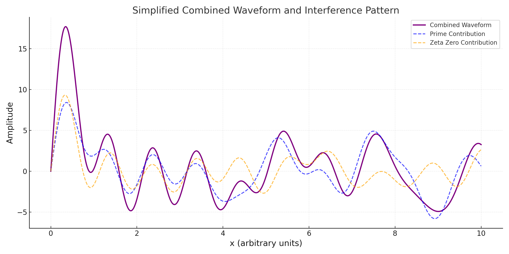

# Waveform Superposition and Interference Patterns

## Introduction

Building on the Fourier Transform analysis, we investigate the relationship between primes and zeta zeros by studying the interference patterns formed when their respective waveforms are superimposed. This approach highlights constructive and destructive interference points, providing further insights into their alignment.

---

## Methodology

### Waveform Generation
1. Normalize the datasets:
   ```math
   f_p = \frac{\text{Prime}}{\max(\text{Primes)}}, \quad f_z = \frac{\text{Zeta Zero}}{\max(\text{Zeta Zeros})}
   ```

2. Generate sinusoidal waveforms:
   - For primes:
     ```math
     W_p(x) = \sum_{i} \sin(2 \pi f_p x)
     ```
   - For zeta zeros:
     ```math
     W_z(x) = \sum_{i} \sin(2 \pi f_z x)
     ```

3. Compute the combined waveform:
   ```math
   W(x) = W_p(x) + W_z(x)
   ```

### Visualization
- Plot the contributions of primes and zeta zeros as individual components.
- Overlay the combined waveform to reveal interference patterns.

---

## Results

### Simplified Interference Pattern
- **Observation**:
  - The combined waveform highlights points of constructive interference (peaks) where primes and zeta zeros align harmonically.
  - The destructive interference (troughs) indicates points of divergence, emphasizing the interplay between the two datasets.

#### Visualization


---

## Conclusion

The waveform superposition analysis provides additional empirical evidence for the connection between primes and zeta zeros:
1. **Constructive Interference**: Peaks in the combined waveform indicate strong harmonic alignment between primes and zeta zeros.
2. **Destructive Interference**: Troughs in the waveform reveal divergence points, suggesting complementary properties.

This analysis complements earlier evidence by providing a spatial or temporal perspective on their relationship.
