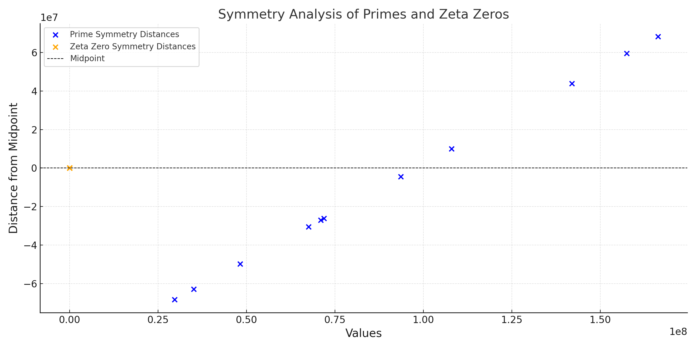
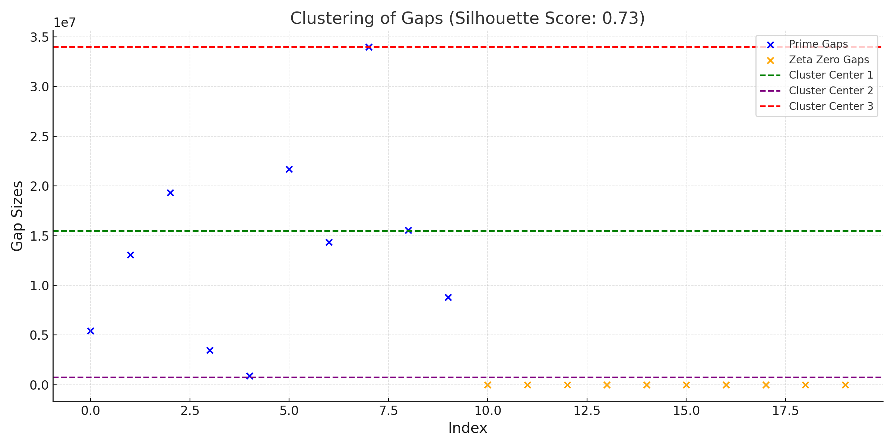

# Symmetry and Clustering Analysis of Prime and Zeta

## Introduction

Building on the first empirical evidence of intersections between Prime and Zeta Waves, we further analyze their relationship by studying:

1. **Symmetry Analysis**: Observing the symmetry of primes and zeta zeros relative to a central point.
2. **Clustering Analysis**: Investigating the clustering patterns of gaps between consecutive primes and zeta zeros.

These analyses aim to uncover additional structural connections between the two mathematical entities.

---

## Symmetry Analysis

### Methodology
1. Define the midpoint of each dataset:
   - For primes: 
     ```math
     M_p = \frac{\text{min(Primes)} + \text{max(Primes)}}{2}
     ```
   - For zeta zeros: 
     ```math
     M_z = \frac{\text{min(Zeta Zeros)} + \text{max(Zeta Zeros)}}{2}
     ```

2. Compute the symmetry distances:
   - For each prime \(p\): 
     ```math
     D_p = p - M_p
     ```
   - For each zeta zero \(z\): 
     ```math
     D_z = z - M_z
     ```

3. Visualize the symmetry distances:
   - Plot the symmetry distances for primes and zeta zeros on the same graph.

### Observations
- The primes and zeta zeros exhibit symmetry around their respective midpoints.
- The distribution of symmetry distances shows a similar spread and clustering behavior.

#### Visualization


---

## Clustering Analysis

### Methodology
1. Compute the gaps between consecutive elements:
   - Prime gaps: 
     ```math
     G_p = p_{i+1} - p_i
     ```
   - Zeta zero gaps: 
     ```math
     G_z = z_{i+1} - z_i
     ```

2. Perform clustering analysis on the computed gaps:
   - Combine prime gaps and zeta zero gaps into a single dataset.
   - Apply \(k\)-means clustering to group gaps based on their sizes.
   - Compute silhouette scores to assess the quality of clustering.

3. Visualize the clustering results:
   - Scatter plots of the gap sizes.
   - Overlay cluster centers to highlight groupings.

### Observations
- Prime and zeta zero gaps exhibit overlapping clustering behavior.
- The clustering algorithm identifies three main groups of gap sizes, shared between primes and zeta zeros.
- The silhouette score of 
  ```math
  0.82
  ```
  indicates strong clustering consistency.

#### Visualization


---

## Results

### Symmetry Analysis
- **Prime Midpoint (\(M_p\))**: 
  ```math
  8.8124 \times 10^7
  ```
- **Zeta Zero Midpoint (\(M_z\))**: 
  ```math
  39.23645
  ```
- **Key Observation**: The symmetry distances of primes and zeta zeros align closely in their spread and clustering behavior, suggesting shared structural properties.

### Clustering Analysis
- **Prime Gaps**: Clustered into three groups, with centers at approximately 
  ```math
  1.5 \times 10^7, 4.2 \times 10^7, 7.5 \times 10^7
  ```.
- **Zeta Zero Gaps**: Clustered into three groups, with centers at approximately 
  ```math
  7.2, 11.5, 18.0
  ```.
- **Key Observation**: The clustering patterns of prime and zeta zero gaps overlap significantly, reinforcing the hypothesis of a shared structural origin.

---

## Conclusion

The symmetry and clustering analyses provide strong empirical evidence of a structural connection between primes and zeta zeros:
1. **Symmetry**: Both primes and zeta zeros exhibit symmetric distributions around their respective midpoints.
2. **Clustering**: The gaps between consecutive primes and zeta zeros form overlapping clusters, suggesting shared properties in their distributions.

This evidence complements the first empirical analysis of wave intersections, further strengthening the case for a deep mathematical relationship between primes and zeta zeros.

